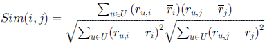
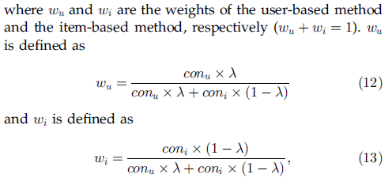

### 1 简介
In this paper, we present a collaborative filtering approach for predicting QoS values of Web Services and making Web service recommendation by taking advantages of past usage experiences of users.

文章主要利用协调过滤的思想来处理QoS值预测和相关服务推荐的问题。主要的贡献有以下几点：

1. 提出一个用户协调的机制来收集不同用户不同Web服务的历史QoS数据；
2. 提出一个结合传统user-based和item-based的协同过滤方法来预测Web service的QoS值，这种方法不需要调用服务而是通过分析相似用户的历史QoS值来进行预测；
3. 最后，在大规模的真实的环境下进行试验，验证QoS预测结果。共有22个国家的100个真实服务，24个国家的150个用户的150万条QoS数据被收集。
小结：文章的亮点一是利用协调过滤的思想应用到QoS预测（不确定在这之前有没有人使用这个方法应用到QoS预测），第二个是建立一个真实的实验数据集，这是系列文章最为基础的一部分。

###2 用户协调QoS数据收集
关于数据收集的系统描述，在另一篇文章（Wsrec A Collaborative Filtering Based Web Service Recommender System）

###3 相似度计算
Pearson Correlation Coefficient （PCC） 皮尔逊相关系数

用户a与u的相似度计算：

服务i与j的相似度计算：

##### 3.2 Significance Weighting 重要性权重
重要性权重是避免了一些用户或服务并不是真正相似而是在某些少数的服务上相似的情况。用两个用户使用服务的交集（两个服务共同用户的交集）*2除以并集，即可避免这种情况。

用户加权重相似度：

服务加权重相似度：

###4 QoS值得预测

##### 4.1 相似邻居的选择
由于皮尔逊相关系数计算得到的结果在[-1,1]之间，所以，论文选用相似度大于0的邻居作为相似邻居。

#####4.2 缺失值预测
UPCC 基于用户协调过滤的QoS预测：

IPCC 基于物品协调过滤的QoS预测：

将UPCC与IPCC结合在一起：

置信权重：

user-based和item-based结合一起的QoS预测：

上面公式得到一个较为完备的UPCC与IPCC结合的模型。

#####4.3 为活跃用户提供QoS值预测
值预测的情况与为用户-服务矩阵预测空值的情况一致。

#####4.5 计算复杂度分析

###5 实现与实验
整个数据收集的环境在Planet-lab上进行：http://www.planet-lab.org

实验采用MAE（平均绝对误差）和RMSE（均方根误差）的指标

####对比实验
* 当前模型与基本协同过滤QoS预测模型对比:
    1. UMEAN 
    2. IMEAN 
    3. UPCC 
    4. IPCC 
    5. WSRec

* 当前模型与其他state-of-the-art 协调过滤QoS预测模型对比:
    1. Personalized QoS Prediction(PQP) 
    2. Similarity Fusion(SF)
* 模型调参的对比
    1. Impact of the Missing Value Prediction
    2. Impact of the Significance Weight
    3. Impace of the Cofidence Weight
    4. Impact of Enhanced Top K
    5. Impact of λ
